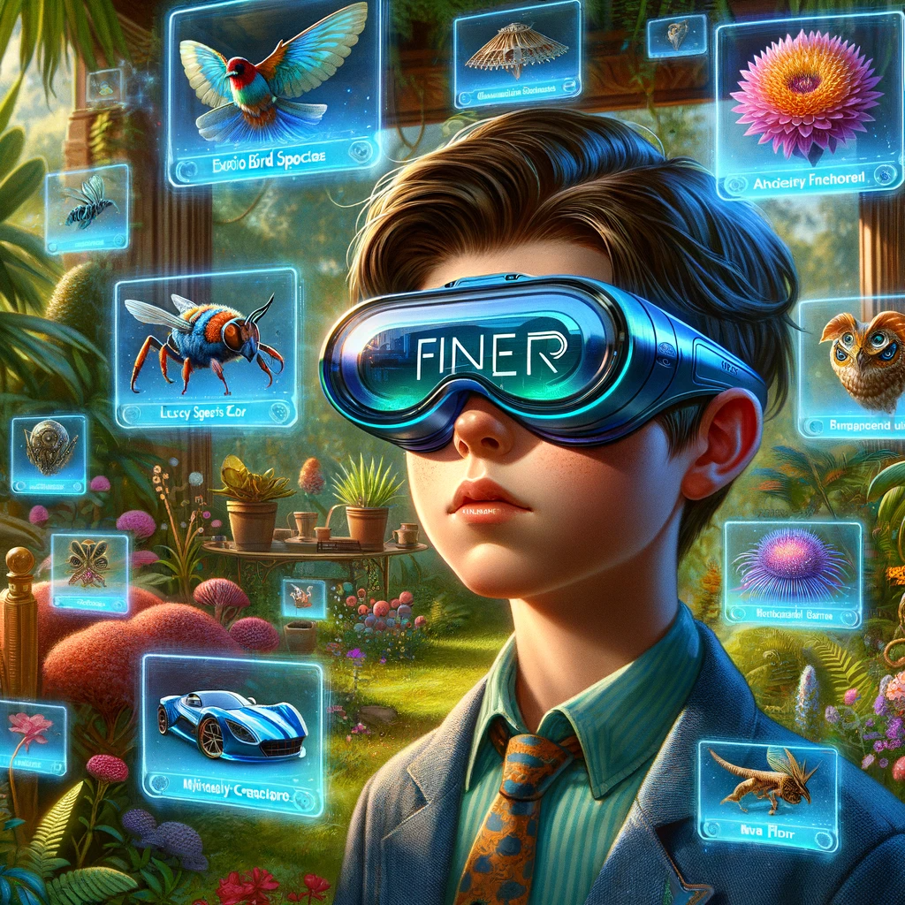
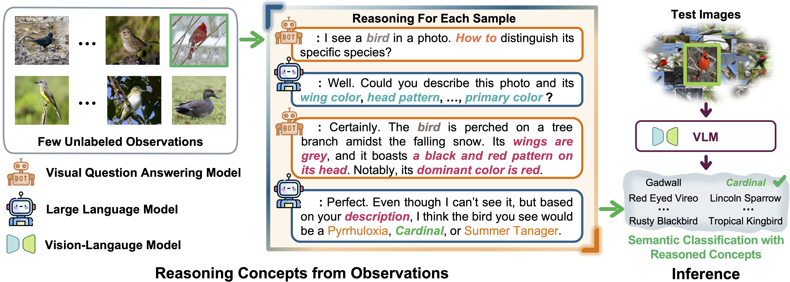

<!-- PROJECT LOGO -->

<p align="center">

  <h1 align="center"></h1>
  <h1 align="center">Democratizing Fine-grained Visual Recognition with Large Language Models</h1>
  <p align="center">
    <a href="https://oatmealliu.github.io/"><strong>Mingxuan Liu</strong></a>
    ·
    <a href="https://roysubhankar.github.io/"><strong>Subhankar Roy</strong></a>
    ·
    <a href="https://scholar.google.com/citations?user=uBjSytAAAAAJ&hl=en"><strong>Wenjing Li</strong></a>
    ·
    <a href="https://zhunzhong.site/"><strong>Zhun Zhong</strong></a>
    ·
    <a href="https://scholar.google.com/citations?user=stFCYOAAAAAJ&hl=en"><strong>Nicu Sebe</strong></a>
    ·
    <a href="https://scholar.google.ca/citations?user=xf1T870AAAAJ&hl=en"><strong>Elisa Ricci</strong></a>
  </p>
  <h2 align="center">ICLR 2024</h2>
  <h3 align="center"><a href="https://openreview.net/forum?id=c7DND1iIgb">OpenReview</a> | <a href="https://arxiv.org/abs/2401.13837">Paper</a> | <a href="https://projfiner.github.io/">Project Page</a></h3>
<div align="center"></div>
<p align="center">
  <p>
  <strong>TL;DR</strong>: We propose <strong>Fine-grained Semantic Category Reasoning (FineR)</strong> system to address fine-grained visual recognition without needing expert annotations and knowing category names as a-priori. FineR leverages large language models to identify fine-grained image categories by interpreting visual attributes as text. This allows it to reason about subtle differences between species or objects, outperforming current FGVR methods.
  </p>
  <a href="">
    
  </a>
<br>


## News 📣:
- [02/29/2024] Code released!
- [01/15/2024] Our work is accepted to <a href="https://iclr.cc/Conferences/2024"><strong>ICLR 2024</strong></a> 🌼! Code is coming soon. See you in Vienna this May!


## Citation
```
@inproceedings{
    liu2024democratizing,
    title={Democratizing Fine-grained Visual Recognition with Large Language Models},
    author={Mingxuan Liu and Subhankar Roy and Wenjing Li and Zhun Zhong and Nicu Sebe and Elisa Ricci},
    booktitle={The Twelfth International Conference on Learning Representations},
    year={2024},
    url={https://openreview.net/forum?id=c7DND1iIgb}
}
```